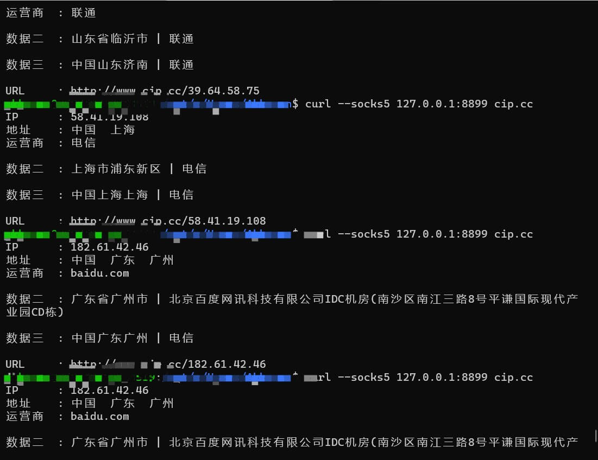

# rotateproxy

利用 fofa 搜索 socks5 开放代理进行代理池轮切的工具

## 特性

- 支持认证
- 代理列表优选策略：随机、或延时前多少位随机

## 帮助

```shell
.\rotateproxy.exe -h
Usage of rotateproxy.exe:
  -check string
        check url (default "https://www.google.com")
  -checkWords string
        words in check url (default "Copyright The Closure Library Authors")
  -email string
        email address
  -l string
        listen address (default ":8899")
  -page int
        the page count you want to crawl (default 5)
  -pass string
        authentication password
  -proxy string
        proxy
  -region int
        0: all 1: cannot bypass gfw 2: bypass gfw
  -rule string
        search rule (default "protocol==\"socks5\" && \"Version:5 Method:No Authentication(0x00)\" && after=\"2025-03-01\" && country=\"CN\"")
  -strategy int
        0: random, 1: Select the one with the shortest timeout (default 1)
  -token string
        token
  -user string
        authentication username
```

### 参数说明

- `-check`，`-checkWords`: 如果你希望你找出来的代理能够访问某个特定网站，可以使用 `-check` 和 `-checkWords`，checkWords 为一串字符，用来保证确定是访问的该网站，比如 `-check "https://www.google.com" -checkWords "Copyright The Closure Library Authors"`，目的就是找出来的代理能够访问 [https://www.google.com](https://www.google.com)，并且返回内容中含有 `Copyright The Closure Library Authors`
- `-email`，`-token`: fofa 的邮箱和 token
- `-l`: 本服务的 socks5 监听地址
- `-page`: fofa 结果默认爬取多少页（每页固定爬取 100 条）
- `-user`，`-pass`: 本服务的 socks5 用户名密码认证
- `-proxy`: 如果提供，将使用该 proxy 来访问 fofa 获取代理地址
- `-region`: 用来筛选是否能访问谷歌

## 安装

```shell
go get -u github.com/akkuman/rotateproxy/cmd/...
```

或者到[发布页面](https://github.com/akkuman/rotateproxy/releases/latest)进行下载

```shell
curl -L -o rotateproxy 'https://github.com/akkuman/rotateproxy/releases/latest/download/rotateproxy-linux-amd64'
chmod +x ./rotateproxy
```

### 安装为 linux 服务（感谢 [@Rvn0xsy](https://github.com/Rvn0xsy) 提供 [PR](https://github.com/akkuman/rotateproxy/pull/4)）

1. 下载相关文件

```shell
curl -L -o /usr/local/bin/rotateproxy 'https://github.com/akkuman/rotateproxy/releases/latest/download/rotateproxy-linux-amd64'
chmod +x /usr/local/bin/rotateproxy
curl -L -o /usr/lib/systemd/system/rotateproxy.service 'https://raw.githubusercontent.com/akkuman/rotateproxy/master/rotateproxy.service.example'
```

2. 查看 [rotateproxy.service.example](./rotateproxy.service.example) 文件示例，将 `/usr/lib/systemd/system/rotateproxy.service` 文件中的 `ExecStart` 的命令替换为你自己的命令

3. 启动服务

```shell
# 开启服务
service rotateproxy start
# 关闭服务
service rotateproxy stop
# 重启服务
service rotateproxy restart
# 设置开机自启动
systemctl enable rotateproxy.service
```

4. 使用

```bash
curl --proxy "socks5://127.0.0.1:8899" https://example.com
```

## 效果展示



## 开发

### 注意

1. 该项目为了交叉编译方便，采用的 cgo-free 的 sqlite3 库，该库默认可能开启了 `SQLITE_FCNTL_PERSIST_WAL`，导致就算 Close 了数据库连接依旧不会删除 wal 文件，所以可能你会在 .db 旁边看到 -shm 和 -wal 文件，如果需要共享该数据库，请将这三个文件一并打包发送
